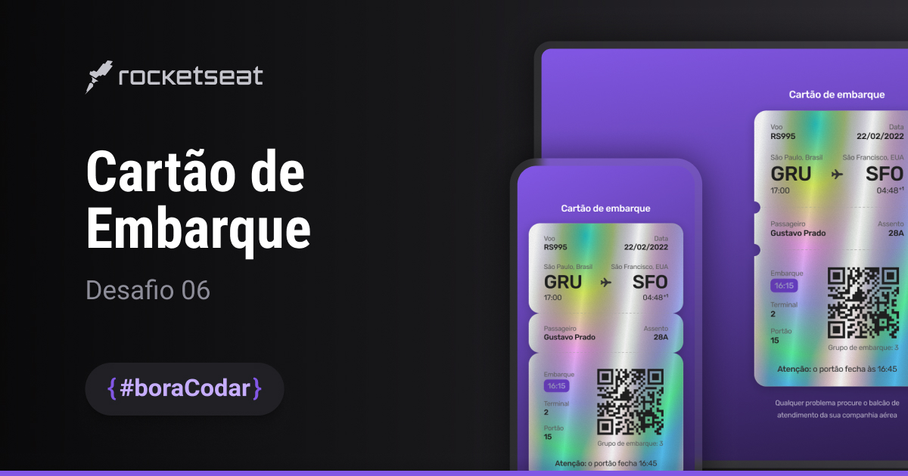

<!-- title page -->
<h1 align="center"> Cartão de Embarque </h1>

<!-- nav -->

  <a href="#-tecnologias">Tecnologias</a>&nbsp;&nbsp;&nbsp;|&nbsp;&nbsp;&nbsp;
  <a href="#-projeto">Projeto</a>&nbsp;&nbsp;&nbsp;|&nbsp;&nbsp;&nbsp;
  <a href="#-layout">Layout</a>

<!-- cover -->

  

## 🚀 Tecnologias
Esse projeto foi desenvolvido com as seguintes tecnologias:

- HTML e CSS
- Git e Github
- JavaScript

 

## 💻 Projeto
O projeto <strong>Cartão de Embarque</strong> é uma aplicação que desafia modelos puramente estéticos através de um layout moderno e interativo, desenvolvido de forma independente como desafio da série #BoraCodar da [Rocketseat](https://www.rocketseat.com.br/).  

Neste projeto foram desenvolvidas soluções em <strong>HTML</strong> e <strong>CSS</strong>, aplicando soluções semânticas e modernas. Além disso, seus scripts foram produzidos com <strong>JavaScript</strong> puro.

> [Navegue pela aplicação aqui](https://rkt-bcd-06-ticket.vercel.app/)

 

## 🔖 Layout
Desenvolvido por [Ilana Mallak](https://www.linkedin.com/in/ilanamallak/), Product Designer na Rocketseat, você também pode acessar o [layout do projeto aqui](https://www.figma.com/proto/ujxawixamBdpciuMkay1KG/Cart%C3%A3o-de-Embarque-%E2%80%A2-Desafio-06?page-id=1%3A7&node-id=2302-5&viewport=56%2C25%2C0.32&t=6zVqNRmFIzIOqNi4-1&scaling=min-zoom&content-scaling=fixed).